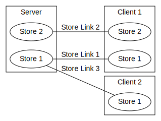

# co-share (Coconut **SHA**red sto**RE**)

**Architecting shared applications using js & node.js.**

## Motivation

Building **multiuser applications for the web** can become challenging as asynchronous communication can drastically increase the system complexity.
Writing **robust and performant shared applications** requires a structured and fitting architecure.

We propose the abstraction of **shared stores** to contain shared logic and data between any participating system.
By using js & node.js the same store can be used on the client and on the server to carry out the **platform indepedent communication**.

## How to use / Example Use-Case

**using SocketIO (co-share-socketio) for network communication & zustand for state storing**

_only an overview | full source code under: TBD_

**Shared**

```typescript
export class CounterStore extends Store {
    public subscriber: Subscriber = Subscriber.create(CounterStore, (connection, accept, deny) =>
        //accepting all incomming connections and providing the current state as initial parameters
        accept(this.state.getState().counter)
    )

    public state: StoreApi<{ counter: number }>

    public onUnlink(link: StoreLink): void {}

    public onLink(link: StoreLink): void {}

    constructor(value: number) {
        super()
        //initializing the state with the retrieved value
        this.state = create(() => ({ counter: value }))
    }

    //increases the local counter value and publishes the Action invocation to all other participants
    increase = Action.create(this, "incr", (origin) => {
        //publishing to all other subscribed clients
        this.increase.publishTo(origin == null ? { to: "all" } : { to: "all-except-one", except: origin })
        //updating own state
        this.state.setState({
            counter: this.state.getState().counter + 1,
        })
    })
}
```

**React-client**

```typescript
function Counter({ parentStore, name }: { parentStore: Store }) {
    //implict subscription to the "counter" store as a child of the parent store
    const store = useChildStore(parentStore, parentStore.links[0], CounterStore, 1000, "counter")
    //getting the state hook from zustand
    const useStoreState = useMemo(() => create(store.state), [store])

    //reading the current counter value
    const { counter } = useStoreState()

    return (
        <div>
            <button
                onClick={() => {
                    //triggering the store's "increase" action
                    store.increase()
                }}>
                increase
            </button>
            <span>{counter}</span>
        </div>
    )
}
```

**Server**

```typescript
//providing the counter store under "counter" with an initial value of 0
rootStore.addChildStore(new CounterStore(0), false, "counter")
```

## Architecture

**Example**



**In depth description:**

This framework revolves arround the idea of **Stores**, which can represent any entity or information. **Stores** are classes which can contain **Actions**. **Actions** are methods that can be executed remotely. The communication to enable this execution is carried out by the specific connection, e.g. using socketio.

However, executing a **Action** requires an established **StoreLink** for a connection. This **StoreLink** uniquely identies the relation between local store and remote store and vice verca.
Setting up a **StoreLink** can either be done manually or automatically through **subscribing** to a certain **Store**. Through subscribing to a **Store** initial parameters are fetched from the host **Store**. The parameters are provided by a **Subscriber** running on every **Store** to determine if and what a requesting client should know about the **Store**.

**Store**s can be organized in a hierachical mannor since every store saves a list of child **Store**, which can be adapted at runtime. **Subscribing** to a **Store** requires to execute the _requestSubscribeToChild_ **Request**, which exists on every **Store**. **Request**s are defined through **Action**s internally and allow to have asynchrounous return values for remote logic invocation.

## Supporting Packages

-   **co-share-socketio** - networking implementation using [socketio](https://github.com/socketio/socket.io)
-   **co-share-peer** - p2p audio/video/data streaming/communication using [simple-peer](https://github.com/feross/simple-peer)
-   **co-share-geckosio** - _Idea_ - networking implementation using [geckosio](https://github.com/geckosio/geckos.io)
